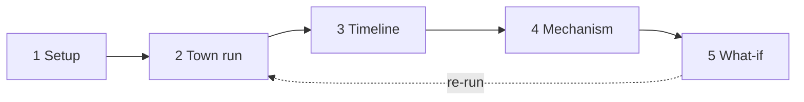

# Simffee — Spec: Coffee What-If Machine

2026-09-19 · @Someone

## 1. The demo thesis

Simulation has to answer a question that static analysis cannot: **which mechanism caused sales to drop, and which intervention actually targets that mechanism.** Everything in this spec serves one moment: the judges watch the obvious reading (price) get refuted by the simulation, and then watch two what-if branches diverge.

This is a miniature clone of the Simile argument from *Building the What-If Machine*: behavior (what) + motivation (why) combine into mechanism; either one alone leads to the wrong decision. Their Isabella/Baskin-Robbins example is our demo scenario, with ice cream swapped for coffee.

Three fixed constraints:

- **Every twin has two data layers**: a 30-day behavior log (what) and an interview transcript (why). A descriptive persona alone is not enough.
- **The final output is mechanism attribution + counterfactual**, not "strengths and weaknesses." An LLM can write the latter without any simulation.
- **All user data is synthetic and labeled as such in the UI.** Hardcoding the scenario is legitimate; fabricating data about real people is not.

| Item | Value |
| --- | --- |
| Twins | 10 |
| Grid | 5×5, Manhattan distance |
| Shops | 2 (Simffee Coffee at (1,1), Starbucks at (3,3)) |
| Simulated days | 7 |
| Scenarios | 1 baseline + 2 counterfactuals |
| Seeds per scenario | 5 (for computing confidence) |
| Max LLM calls | 10 twins × 7 days × 3 scenarios × 5 seeds = 1,050; in practice \~40% because autopilot makes no LLM call |

## 2. The four mechanism variables

These four numbers are the entire "physics" of the simulation. The LLM only makes a decision when the mechanism opens the door for it; the rest is pure arithmetic — no tokens spent, and fully explainable.

| Variable | Type | Derived from | Meaning |
| --- | --- | --- | --- |
| `habit[shop]` | float 0–1, one value per shop | what-log: share of the last 30 days spent at that shop | Inertia. High = autopilot, no deliberation |
| `disruption_threshold` | float 0–1 | why-transcript: tolerance for change | This twin's own habit-breaking threshold |
| `latent_interest[shop]` | float 0–1, per non-regular shop | why-transcript: heard of / tried / curious about it | Smoldering curiosity, activated only when habit breaks |
| `social_links` | 2–3 twin ids adjacent on the grid + `talkativeness` 0–1 | home position | The word-of-mouth channel |

### 2.1 habit — inertia

Rises with repetition, decays with absence. Each day, after a twin picks shop `s`:

```latex
h_s \leftarrow h_s + \alpha(1 - h_s), \quad h_o \leftarrow h_o(1 - \delta) \ \forall o \ne s
```

With α = 0.15 and δ = 0.05. That means roughly 4 consecutive days for a new shop to cross the 0.6 threshold, and 6–8 days for the old shop to fall below 0.5 if unvisited. This asymmetry is deliberate: new habits form faster than old habits dissolve, so **one week of broken habit is enough to lose a customer**.

The regular shop `current` = argmax habit. If `habit[current] ≥ 0.6` and there is no disruption → **autopilot**: the twin goes to the regular shop, no LLM call. The log records `mode: autopilot`.

### 2.2 disruption — what breaks a habit

Each day, for the regular shop, compute a disruption score from the gap between **expectation** (drawn from the what-log) and **today's reality** (from the scenario):

| Source | Score | Condition |
| --- | --- | --- |
| Opening hours | 1.0 | Shop is closed at the twin's `usual_time` |
| Price | min(1, Δprice / old price × 4) | Increase ≥ 5% |
| Usual item unavailable | 0.7 | `usual_order` no longer in `products` |
| Long wait | min(1, (wait − tolerance) / 10) | Exceeds `wait_tolerance` |
| Permanently closed | 1.0 |  |

`disruption = max` over the sources (not a sum — take the largest shock). If `disruption > disruption_threshold` → habit is **suspended** for today → the twin enters **reappraisal**: call the LLM, consciously weigh every option.

This is exactly the Isabella mechanism: a 9% price increase does not make her angry, it makes her **stop and look at the shelf**. What she picks while looking at the shelf is the job of the next variable.

### 2.3 latent\_interest — smoldering curiosity

Rises from three sources, each day:

- Word of mouth: a neighbor reports a good experience at shop `o` → `+0.10 × valence`; a bad experience → `−0.10`
- Marketing: `+ reach[o] × ad_sensitivity`, capped at +0.05/day
- First-hand experience: visiting a non-regular shop clears its accumulated `latent_interest[o]` and reinforces `habit[o]`. `engine.loop.run_day()` also records the shop in `visited`, initialized from the what-log and persisted in snapshots. This is observed visit history, not a new tunable preference. Zero curiosity after experience must not be read as refusal to return; `engine.decide.reappraise()` lets previously experienced, open alternatives reach deliberation. Positive or negative recent experiences remain in the three-day memory.

The most important rule: **latent\_interest can only be acted on when habit is suspended** (reappraisal), or when `latent_interest[o] > habit[current] + 0.3` (rare — this models the person who actively seeks change). Outside those two gates, it just accumulates silently. This is why marketing alone barely pulls a competitor's regulars, but marketing + a shock does.

### 2.4 social\_links — word of mouth

Each twin has 2–3 neighbors (adjacent grid cells). At the end of each day, with probability `talkativeness`, the twin tells each neighbor about their experience. The content is `(shop, valence)`, with `valence` ∈ \[−1, 1\] taken from the LLM output (or a default of +0.3 for an uneventful autopilot day). Neighbors update `latent_interest` per 2.3.

One day of lag: what is said today affects tomorrow's decision. Fast enough to spread within 7 days, not so fast as to be unrealistic.

### 2.5 How the four variables compose into a mechanism

```mermaid
flowchart TD
  A[New day] --> B{habit[current] ≥ 0.6?}
  B -- no --> R[Reappraisal: LLM call]
  B -- yes --> C{disruption > threshold?}
  C -- no --> P[Autopilot: go to regular shop]
  C -- yes --> R
  R --> D[Pick a shop / skip]
  P --> U[Update habit]
  D --> U
  U --> S[Tell neighbors → latent_interest]
  S --> A
```

Read it as: a twin only "thinks" when the habit is weak or shocked. Inside reappraisal, `latent_interest` is what decides where they turn. So the same price increase applied to two twins with identical price sensitivity but different `latent_interest` produces two different outcomes — and a discount cannot reverse a twin who has already left.

## 3. Data model

Three static JSON files (twins, shops, scenarios) and one state file generated at runtime. No database; everything lives in `/data`.

### 3.1 Twin

Each twin is a file `data/twins/T01.json`. Both the what/why layers are mandatory; `say_do_gap` is present on only 3 twins.

```json
{
  "id": "T01",
  "name": "Minh",
  "home": [0, 1],
  "profile": {
    "age": 29, "occupation": "software engineer",
    "usual_time": "06:45", "usual_order": "latte",
    "daily_budget_vnd": 60000, "walk_tolerance": 3, "wait_tolerance_min": 6
  },
  "what_log": [
    {"day": -30, "shop": "simffee", "time": "06:45", "spent": 45000, "abandoned": false},
    {"day": -29, "shop": "simffee", "time": "06:50", "spent": 45000, "abandoned": false}
  ],
  "why_transcript": [
    {"q": "When did you last pay extra just to avoid waiting?", "a": "Last week — 25k for express delivery..."},
    {"q": "Is there anything you know is bad but keep using because switching is a hassle?", "a": "My mobile carrier. Three years now."}
  ],
  "mechanism": {
    "habit": {"simffee": 0.82, "starbucks": 0.08},
    "disruption_threshold": 0.45,
    "latent_interest": {"starbucks": 0.35},
    "social_links": ["T02", "T04"],
    "talkativeness": 0.5,
    "ad_sensitivity": 0.2
  },
  "say_do_gap": null
}
```

Rules for deriving `mechanism` from the two layers above, so the four variables are not arbitrary invented numbers:

| Variable | Derived from |
| --- | --- |
| `habit[s]` | `count(what_log where shop == s) / 30` |
| `disruption_threshold` | why-transcript: a long, specific answer to the "switching is a hassle" question → 0.55–0.7; an answer like "I switch constantly" → 0.25–0.4 |
| `latent_interest[o]` | why-transcript mentions shop `o` (heard about it from a friend, saw an ad, tried it once) → 0.3–0.5; no mention → 0.05–0.15 |
| `talkativeness` | the "when did you last tell someone about a coffee shop" question |

### 3.2 Shop

`data/shops.json`, two entries. Every field can be overridden per day by a scenario.

```json
{
  "simffee": {
    "name": "Simffee Coffee", "position": [1, 1],
    "price": {"latte": 45000, "americano": 35000, "cold_brew": 50000},
    "open": "06:30", "close": "20:00",
    "products": ["latte", "americano", "cold_brew"],
    "quality": 0.78, "avg_wait_min": 4,
    "marketing": {"reach": 0.15, "message": "Roasted on site every morning"}
  },
  "starbucks": {
    "name": "Starbucks", "position": [3, 3],
    "price": {"latte": 65000, "americano": 50000, "cold_brew": 70000},
    "open": "06:00", "close": "22:00",
    "products": ["latte", "americano", "cold_brew", "frappuccino"],
    "quality": 0.70, "avg_wait_min": 7,
    "marketing": {"reach": 0.40, "message": "Fall menu is here"}
  }
}
```

### 3.3 Scenario

A scenario = a name + a list of per-day overrides. The baseline has an override on day 4; counterfactuals inherit the baseline and add overrides from day 5.

```json
{
  "id": "baseline",
  "parent": null,
  "overrides": [
    {"from_day": 4, "shop": "simffee", "set": {"open": "07:00", "price.latte": 48000}}
  ]
}
```

```json
{"id": "cf_discount", "parent": "baseline",
 "overrides": [{"from_day": 5, "shop": "simffee", "set": {"price.latte": 38000}}]}
```

```json
{"id": "cf_restore_hours", "parent": "baseline",
 "overrides": [{"from_day": 5, "shop": "simffee", "set": {"open": "06:30"}}]}
```

The engine resolves shop state for day `d` by applying the parent's overrides and then its own, ordered by `from_day`.

### 3.4 Trajectory (output)

One row per twin per day per scenario per seed, written to `runs/{scenario}/{seed}.jsonl`. This is what the Analyzer reads and the UI displays.

```json
{
  "scenario": "baseline", "seed": 2, "day": 4, "twin": "T01",
  "mode": "reappraisal",
  "disruption": {"score": 1.0, "source": "hours"},
  "state_before": {"habit": {"simffee": 0.82, "starbucks": 0.08}, "latent_interest": {"starbucks": 0.41}},
  "choice": "starbucks", "spent": 65000, "abandoned": false,
  "primary_driver": "hours", "secondary_driver": "curiosity",
  "valence": 0.4,
  "reasoning": "My usual place wasn't open at 6:45. I had to go somewhere else anyway, and Starbucks has that fall cold brew Linh raved about yesterday.",
  "state_after": {"habit": {"simffee": 0.78, "starbucks": 0.22}, "latent_interest": {"starbucks": 0.0}},
  "told": ["T02"]
}
```

The `primary_driver` field is mandatory and drawn from a closed set: `habit | hours | price | distance | wait | product | curiosity | social | quality`. It is what lets the attribution in section 6 run by counting rather than by having an LLM re-read everything.

`engine.schema.Row` additionally exports `llm_failed`, `decision_source` (`autopilot`, `rule`, `llm`, or `fallback`), `llm_model`, and `llm_cache_key`. Model/cache provenance is identical on live generation and warm replay, preserving byte-for-byte determinism. Legacy fixtures without provenance remain usable for analyzer tests but are not publishable model evidence. `engine.schema.validate_row()` and `tools.validate.check_file()` share the 40-word reasoning limit; the latter also checks the full ordered day/twin grid.

## 4. The 7-day loop and the decision function

Each day is one pass over the 10 twins in a fixed order, followed by one word-of-mouth pass. Nothing runs concurrently within a day, so results are reproducible for a given seed.

### 4.1 The loop

```python
def run(scenario, seed, twins, shops, days=7):
    rng = random.Random(seed)
    state = init_state(twins)          # habit, latent_interest from mechanism
    for day in range(1, days + 1):
        shops_today = resolve(shops, scenario, day)
        inbox = {t.id: [] for t in twins}   # yesterday's gossip already applied to state
        for t in twins:
            s = state[t.id]
            current = argmax(s.habit)
            disr = disruption(t, shops_today[current], s)
            if s.habit[current] >= 0.6 and disr.score <= t.disruption_threshold:
                rec = autopilot(t, current, shops_today)
            else:
                rec = reappraise(t, s, shops_today, disr, rng)   # LLM call
            apply_habit(s, rec.choice)
            log(rec)
        gossip(twins, state, rng)      # update latent_interest for tomorrow
```

`resolve()` applies the parent scenario's overrides, then the child's. `disruption()` is the table in 2.2. `gossip()` is 2.4.

### 4.2 Autopilot

No LLM call. Records `mode: autopilot`, `choice: current`, `primary_driver: habit`, `valence: +0.3`, `reasoning: "Same as every day."`. If the regular shop is closed today or out of the usual item but disruption still falls below the threshold (a twin with a very high threshold), the twin **skips** (`choice: none`) instead of automatically walking to the competitor. This is the real behavior of a high-inertia person: they go without rather than switch.

### 4.3 Reappraisal — the LLM call

Implementation: `engine.decide.reappraise()`, with prompts from `engine.prompt.build()` and transport in `engine.llm.complete_json()`. Before a call, an hours shock plus maximum alternative curiosity below 0.20 forces skipping only if there is no previously experienced, open alternative. This rule is not in `autopilot()` and does not special-case T08. A repeat visit is allowed to reach deliberation, not forced to buy.

Uncached deliberation requests use Groq, `temperature 0.7` with one invalid-response retry at 0.3, and `max_tokens` 400 by default. The model defaults to `qwen/qwen3.8-27b` (a non-reasoning instruct model with JSON mode; the committed `cache/` was filled with this model and token cap, and both are part of the cache key), configurable with `SIMFFEE_MODEL` or `--model`; the token cap is configurable with `SIMFFEE_MAX_TOKENS`. Live requests require `GROQ_API_KEY`. Temperature and `response_format` JSON-schema support are probed per model with bounded retries; unsupported fields remain omitted on subsequent requests. Local validation is mandatory even without provider-side structured output.

The prompt has four blocks, in order:

1. **Identity** — profile + the 3 most relevant why-transcript lines (selected by keyword match against `disruption.source`; no embeddings needed).
2. **Today** — the time, money left for the day, the disruption and its source.
3. **Options** — for each shop: distance, price of the usual item, opening time, wait, plus `habit` and `latent_interest` rendered into words ("you've been here 24 of the last 30 days", "your neighbor Linh praised the cold brew here yesterday").
4. **3-day memory** — choice + valence + condensed reasoning for the last 3 days.

`engine.prompt.build()` reads `say_do_gap.log_shows` (with legacy `does` compatibility), states that a shop cannot serve only when it is actually closed, and distinguishes a missing usual item from total unavailability. Price and wait shocks do not remove an open shop from the options. `engine.decide.price_for()` uses the cheapest available item if the usual item was removed. Social links and ad sensitivity alone are not evidence that a particular endorsement or advertisement was heard; prompts must not invent those events.

Output schema, mandatory:

```json
{
  "choice": "simffee | starbucks | none",
  "primary_driver": "habit | hours | price | distance | wait | product | curiosity | social | quality",
  "secondary_driver": "...",
  "valence": -1.0,
  "reasoning": "≤ 40 words, first person"
}
```

Three constraints in the system prompt:

- Answer **as this person**, not as an assistant. Never say "as an AI."
- `primary_driver` must be the **real** reason present in the reasoning, not the flattering one. If the reason is "I had to go somewhere else anyway, might as well try it," the drivers are `hours` + `curiosity`, not `price`.
- For twins with a `say_do_gap`: the Identity block contains both the stated claim and a summary of the what-log. The system prompt states: *"The behavior in the log matters more than what you say about yourself. When the two conflict, act according to the log."*

Validating output: parse the JSON, check enums, finite valence, reasoning, and shop availability; on invalid output → retry once at `temperature 0.3`; on a second failure → `engine.decide._fallback()` invokes `autopilot()` and flags `llm_failed: true`. Offline cache misses and unavailable transport also produce flagged diagnostic fallbacks. Error details are sanitized and reasoning remains at most 40 words. Such skips are technical placeholders, not observed customer preferences.

`engine.schema.coverage()` and `engine.cli.main()` report full-grid status, reappraisals, fallbacks, skip categories, and model provenance per scenario/seed. `--require-complete` exits 2 for incomplete or unverified runs; schema failures exit 1. A one-day diagnostic run is not a complete seven-day simulation.

### 4.4 Cost

Estimate for one baseline seed: days 1–3 are nearly all autopilot (≈ 3 calls), day 4 has six twins in reappraisal, days 5–7 taper off as new habits form. About 25 calls per seed per scenario, \~400 calls for all 3 scenarios × 5 seeds. At cheap-model pricing, under 1 USD. Run it all before the demo and cache everything.

## 5. The three What-If questions → implementation

Bernstein named the What-If Machine after three questions: *what if we shipped this? what if we shipped a weirder version? and what if we hadn't?* All three are **one mechanism**: re-run from the same snapshot with a different scenario, then compare trajectories. There is no per-question logic.

| Question | In the system | Scenario | Compared against |
| --- | --- | --- | --- |
| What if we ship X? | Baseline: apply the change from day 4 | `baseline` | Days 1–3 (before the change) |
| What if we ship a weirder version? | Same day-4 snapshot, a different change | `cf_*` with `parent: baseline`, overrides from day 5 | `baseline` days 5–7 |
| What if we hadn't? | Same day-4 snapshot, **without** the change | `cf_null`: empty overrides, inherits day-3 state | `baseline` days 4–7 |

### 5.1 Snapshot and fork

After each day, the engine writes `state` (habit, latent\_interest, inbox) to `runs/{scenario}/{seed}/state_day{d}.json`. A counterfactual does not re-run from day 1; it **loads the parent's snapshot for day `from_day − 1`** and continues with its own overrides. Same seed → same random stream for gossip → the only difference between the two branches is the override.

```python
def run_counterfactual(cf, seed):
    parent_state = load(f"runs/{cf.parent}/{seed}/state_day{cf.from_day - 1}.json")
    return run(cf, seed, start_day=cf.from_day, state=parent_state)
```

This is what makes the comparison **fair**: both branches share three identical opening days, so every divergence in days 5–7 is attributable to the intervention.

### 5.2 "What if we hadn't" is the control arm

`cf_null` is the most important scenario and the easiest to forget. It answers: *did sales drop because of our change, or were they going to drop anyway?* If `cf_null` also loses 2 customers because Starbucks' marketing is strong right now, then our change caused only 2 of the 4 lost customers — and the attribution in section 6 has to subtract that portion out.

The UI shows `cf_null` as a faint line on the sales chart, labeled *"if unchanged"*. The gap between the faint line and the baseline line = the true impact of the decision.

### 5.3 Pairwise comparison

Every comparison is **twin-paired**, never aggregate. For each twin, for each day from `from_day`: `choice_A` vs `choice_B`. The result table for one scenario pair:

| Twin | Day 5 | Day 6 | Day 7 | Conclusion |
| --- | --- | --- | --- | --- |
| T01 | starbucks → starbucks | starbucks → simffee | starbucks → simffee | Returns in branch B |
| T03 | simffee → simffee | simffee → simffee | simffee → simffee | Unaffected |

Count the twins whose outcome changes between the two branches. That is the number shown next to each what-if button: *"Restore opening hours: 3 of 4 lost customers return. Cut prices 15%: 1 of 4."*

### 5.4 User-typed what-ifs

A slot for the live demo if time allows: a text box reading *"What if we..."*. The LLM translates free-form input into an override JSON (schema 3.3), the engine forks from the day-4 snapshot, runs 1 seed, and shows the result in \~20 seconds. Not required; the three pre-cached scenarios are enough for the pitch.

## 6. Analyzer: mechanism attribution + confidence

The Analyzer is arithmetic over trajectories. The LLM appears only at the last step, to write two sentences of prose; it is never allowed to produce a number.

### 6.1 Finding the break

Daily sales = the sum of `spent` for twins who chose `simffee`. The break = the first day sales fall ≥ 25% below the trailing 3-day average, **and** `cf_null` does not fall similarly. In the demo scenario, that is day 4.

### 6.2 Naive read vs actual driver

Two independent steps, then a comparison.

**Naive read** = what a person looking at the scenario table would blame. Take the override with the highest `magnitude` per this table:

| Override | Magnitude |
| --- | --- |
| Price change | Δ% × 5 |
| Hours change | 0.3 fixed |
| Item removed | 0.5 |
| Marketing change | Δreach |

Price is deliberately given a high coefficient: price is the first thing a founder looks at when sales drop. In the demo scenario, price +6.7% → 0.33 > hours 0.3. Naive read = **price**.

**Actual driver** = count the `primary_driver` values of the twins who **changed their choice** on the break day versus the previous day. Add `secondary_driver` at weight 0.5.

```python
switchers = [r for r in day_rows if r.choice != prev_choice[r.twin]]
hist = Counter()
for r in switchers:
    hist[r.primary_driver] += 1
    hist[r.secondary_driver] += 0.5
actual = hist.most_common(1)[0][0]
```

If `actual != naive` → **mechanism surprise** → red panel in the UI. If they match → grey panel, *"the obvious reading was right"*, and the counterfactual is still shown.

### 6.3 Evidence

Pick 2 trajectories as evidence: the switcher whose `primary_driver == actual` and whose `reasoning` is longest; and one twin who did **not** switch despite facing the same disruption (proving that disruption alone is not enough — latent\_interest is required). Show the `reasoning` verbatim alongside `state_before`.

### 6.4 Subtracting cf\_null

`impact = switchers(baseline) − switchers(cf_null)`, twin by twin. Only a twin who switches in the baseline and does not switch in cf\_null counts as "lost because of our decision." That number leads the panel: *"4 customers lost — 3 from the hours change, 1 would have been lost anyway."*

`analyzer.attribution.actual_driver()`/`select_evidence()`, `analyzer.impact.impact()`, and `analyzer.pairwise.returns()` withhold conclusions when fallback decisions affect their input trajectories. `build_runs.build_analysis()` conservatively suppresses causal analysis and narration if any required scenario/seed is incomplete; diagnostic rows and sales remain available with coverage labels.

### 6.5 Confidence score

Simile trains a confidence model alongside the simulation model. We substitute two measurable components:

```latex
c = 0.7 \cdot \text{stability} + 0.3 \cdot \text{support}
```

- **stability** = for each twin, the fraction of seeds (out of 5) producing the same `choice` on the break day; averaged over the 10 twins. Autopilot counts as stability 1.0.
- **support** = for twins in reappraisal, the number of why-transcript lines with a keyword matching `primary_driver`, divided by 3, capped at 1. A twin who switches out of `curiosity` whose transcript never mentions Starbucks → low support.

`analyzer.confidence.stability()` counts distinct seeds, excludes fallbacks, and records sample counts even for unmeasured twins. At least three usable seeds are required per measured twin. `confidence()` additionally requires at least one twin with three usable reappraisal seeds and corresponding support in the selected seed; autopilot agreement cannot substitute for deliberation evidence. Otherwise `value` is null and `unmeasured` is true. Partial results retain coverage reasons and per-twin detail in the bundle.

Displayed as `Confidence 0.78` next to each conclusion, with a tooltip breaking out the two components. Conclusions with `c < 0.5` are italicized and labeled *"low confidence — not actionable"*. This line exists so judges can see the system knows when it does not know.

`analyzer.confidence.whatif_confidence()` applies the same weights and minimum-sample guard to each branch. Outcome stability is restricted to the customers baseline lost; unaffected customers cannot pad it. `branch_support()` uses each lost twin's last usable post-intervention reappraisal. Seeds containing earlier fallback decisions are excluded from branch evidence, even if the final outcome is autopilot. The selected default seed is resolved by ID, not list position. `build_runs._whatif()` exports both the scalar `confidence` and detailed coverage in `confidence_detail`, from the same rows used by the bundle. Impact comparisons use the contract field `per_twin.cf_null`, not `control`.

### 6.6 Narration

`analyzer.narrate.narrate()` deterministically renders exactly two sentences from the computed break day, naive driver, actual driver, and impact fields. Each number stays bound to its field: a digit in a price label cannot be reused as a customer count. No LLM client is constructed. Incomplete evidence, unmeasured confidence, invalid counts, or an unmeasured driver produce null narration with a reason. This replaces free-form LLM narration because a number allowlist alone cannot enforce factual correctness.

## 7. The reverse-engineered demo scenario

The target: on day 4, Simffee sales drop \~40%, the naive read is price, the real mechanism is opening hours, and the two what-if branches diverge clearly. Tune the twin parameters until this outcome appears reliably in ≥ 4 of 5 seeds, then cache it. This is staging a scenario, not fabricating data — every number lives in a twin file that anyone can read.

The following counts are illustrative demo targets, not correctness assertions or permission to force outcomes. Repairs must preserve genuine skipping and model discretion. Parameter calibration and new behavioral mechanisms require explicit review. In particular, §2.3's curiosity reset must not override prior experience and force day-5 skipping in conflict with the intended repeat visits below.

### 7.1 Target sequence of events

| Day | Event | Desired outcome |
| --- | --- | --- |
| 1–3 | Stable | 8 of 10 twins go to Simffee on autopilot; 2 twins are Starbucks regulars |
| 4 | Simffee opens late at 07:00 (instead of 06:30), latte +3k | 6 twins with `usual_time` < 07:00 hit disruption = 1.0 → reappraisal. 4 of them have `latent_interest[starbucks] ≥ 0.3` → they switch. 2 twins with high thresholds skip coffee entirely (`none`) |
| 5 | No change | The 4 who switched: habit\[starbucks\] ≈ 0.22, still in reappraisal. 3 stay at Starbucks because yesterday's valence was positive and the hours are still late; 1 returns |
| 6–7 | Word of mouth | 1 more twin switches because a neighbor praised it. Final outcome: 4 customers lost — 3 due to hours, 1 due to gossip |

`cf_null` (keep 06:30, keep the price): loses 1 customer on day 6 to Starbucks marketing. So the true impact = 3.

### 7.2 The two what-if branches

| Branch | Override from day 5 | Desired outcome | Why |
| --- | --- | --- | --- |
| `cf_discount` | latte 38k (−15% from 45k) | 1 of 4 return | 3 of the twins who switched have `primary_driver` of hours/curiosity; price never appears in their reasoning. The 4th is genuinely price-sensitive and returns |
| `cf_restore_hours` | reopen at 06:30, keep 48k | 3 of 4 return | habit\[simffee\] is still ≈ 0.7 after one day away; once the door opens on time, autopilot switches back on. The 4th has already formed a new habit after 3 days |

The two numbers **1/4** and **3/4** are the entire point of the demo. If they come out close together after a run, adjust: raise `latent_interest[starbucks]` for the 3 switching twins to 0.4–0.5 and lower `ad_sensitivity` for the 4th.

### 7.3 The knob on the 48k price

The 3k price increase is deliberately small: enough for the naive read (×5 coefficient) to point at price, not enough for the LLM to actually use it as a reason. If the LLM still records `primary_driver: price` for more than 1 twin, drop it to 47k. If the naive read stops pointing at price, raise the price coefficient in 6.2.

### 7.4 The three say-do gap twins

Each of these twins has a `say_do_gap` field with three parts: the stated claim, the behavior, and the mechanism consequence. The system prompt tells the LLM to act according to the log.

| Twin | Says | 30-day log shows | Consequence in the sim |
| --- | --- | --- | --- |
| T03 Linh | "I pick a shop based on bean quality" | 28 of 30 days at the nearest shop; the other 2 days were when it was closed | `walk_tolerance` 1. Simffee's quality marketing cannot pull her. Only distance and hours can |
| T06 Đức | "I'm pretty frugal" | 65k/day, buys the most expensive cold brew on the menu | Low `ad_sensitivity` to discounts. `cf_discount` does not bring him back |
| T08 Mai | "I love trying new things, I switch shops often" | 30 of 30 days at the same shop, same item, same time | `disruption_threshold` 0.7. The "fall menu" marketing does not move her. On day 4 she **skips coffee** rather than switch shops |

All three appear in the evidence panel where relevant. T06 is the evidence for why `cf_discount` fails; T08 is the evidence that disruption is not enough without latent\_interest.

### 7.5 Mandatory UI label

Bottom corner of every screen, small type, not dismissible: *"Synthetic seed population — 10 synthetic twins, not real people. Results are a pre-testing signal, not a prediction."* The conclusion panel has a link, *"Protocol for replacing twins with real people"*, opening a static page describing: 15-minute interviews, a sealed out-of-domain quiz, and a paired sign test.

## 8. The 10-twin table

Starting parameters that make the scenario in section 7 happen. The "Role" column states what this twin exists to prove; every twin must have a role, otherwise cut it.

Grid: Simffee (1,1), Starbucks (3,3). Manhattan distance; `walk_tolerance` is the maximum number of cells a twin will walk.

| ID | Name | Home | Time | habit simffee / sbux | latent sbux | threshold | talk | Say-do | Role |
| --- | --- | --- | --- | --- | --- | --- | --- | --- | --- |
| T01 | Minh | (0,1) | 06:45 | 0.82 / 0.08 | 0.35 | 0.45 | 0.5 | — | Switches on day 4 due to hours; drivers hours+curiosity. Returns under cf\_restore |
| T02 | Hà | (1,0) | 06:40 | 0.80 / 0.10 | 0.40 | 0.40 | 0.7 | — | Switches on day 4. The main storyteller; pulls T04 on day 6 |
| T03 | Linh | (2,1) | 07:10 | 0.93 / 0.03 | 0.10 | 0.60 | 0.3 | Says quality, acts nearest | Unaffected on day 4 (arrives after 07:00). Stays throughout |
| T04 | Tùng | (0,2) | 08:00 | 0.70 / 0.20 | 0.25 | 0.50 | 0.4 | — | No disruption. Switches on day 6 purely from T02's gossip. The word-of-mouth evidence |
| T05 | Ngọc | (2,2) | 06:30 | 0.75 / 0.15 | 0.45 | 0.35 | 0.6 | — | Switches on day 4, forms a new habit fastest. Does **not** return in either branch |
| T06 | Đức | (1,2) | 06:50 | 0.77 / 0.13 | 0.30 | 0.45 | 0.4 | Says frugal, spends 65k/day | Switches on day 4. cf\_discount doesn't bring him back; cf\_restore does |
| T07 | Vy | (2,0) | 06:35 | 0.85 / 0.05 | 0.05 | 0.50 | 0.2 | — | Switches on day 4 due to hours but latent is low → negative valence at Starbucks → returns on her own on day 5 |
| T08 | Mai | (0,0) | 06:40 | 0.90 / 0.00 | 0.15 | 0.70 | 0.3 | Says novelty-seeking, acts identically every day | Day 4 disruption of 1.0 exceeds her threshold → reappraisal, but latent is low so she **skips coffee** via the rule in 4.3 if current alternative interest stays below 0.20 and no experienced open alternative exists |
| T09 | Khoa | (3,2) | 07:30 | 0.20 / 0.75 | — | 0.50 | 0.5 | — | Starbucks regular. The control showing Simffee marketing pulls nobody from Starbucks without a disruption on that side |
| T10 | An | (4,3) | 08:15 | 0.10 / 0.85 | — | 0.55 | 0.5 | — | Starbucks regular. Genuinely price-sensitive: the only twin `cf_discount` pulls in (from Starbucks), so cf\_discount = +1 new customer, −3 old customers who never return |

Tuning notes:

- The general untried-alternative gate lives in `engine.decide.reappraise()` (§4.3), not `autopilot()` (§4.2). An hours shock with maximum alternative interest below 0.20 and no experienced open alternative yields `none`; all other reappraisals reach the model/cache. T08 is not hard-coded.
- **Unresolved T08 calibration:** marketing raises her Starbucks interest from 0.15 to 0.23 by day 4 with the current data, so the low-interest gate does not apply. Her guaranteed skip role is therefore not established. Changing sensitivity, the threshold, or the intended role requires approval; no such data change was made for this repair.
- **Unresolved T10 mechanism:** `engine.loop.run_day()` computes disruption only for the current regular shop. Simffee's discount does not shock a Starbucks regular, and current interest does not pass the change-seeking gate. Acquiring T10 through competitor pricing requires an approved cross-shop attention mechanism or a revised narrative; the role above is a target, not currently reachable behavior.
- **Unresolved control design:** current `cf_null` data adds a day-6 wait spike, whereas the narrative in §7.1 attributes control loss to marketing. This shock is not shared by the treatment arms. No causal-design assumption or scenario parameter was changed; review the control before treating its subtraction as calibrated evidence.
- T07 is the key twin for confidence: she switches and then returns on her own, so her day-4 `choice` is stable across seeds while day 5 fluctuates. Stability will be lower on day 5, and that is **correct**.
- T09 and T10 are controls: without them, Simffee marketing has no one to act on and the gossip table has no reverse direction.
- Starting Simffee customers = 8 (T01–T08), Starbucks = 2. Baseline day-7 outcome: Simffee 4, Starbucks 5, 1 skipping.

## 9. UI: 5 screens, a 90-second flow

A static web page reading cached JSON. No backend in the demo; the "live what-if" button (5.4) is the only one that calls an API.



| # | Screen | What you see | Seconds |
| --- | --- | --- | --- |
| 1 | Setup | The 5×5 grid with 10 homes and 2 shops. Right panel: price, hours, menu, and marketing for both shops. A **Run 7 days** button | 0–20 |
| 2 | Town run | 7 days play at 2 seconds per day. Each home changes color by the shop visited (blue Simffee, green Starbucks, grey skipped). Faint lines show gossip between adjacent homes. Below the grid: the two sales lines | 20–45 |
| 3 | Timeline | On day 4 the Simffee line breaks, marked with a red dot. The faint `cf_null` line runs parallel above it. Click the dot → screen 4 | 45–50 |
| 4 | Mechanism | Left: **The obvious reading** — "Price +3k". Right, red border: **The real mechanism** — "Opened 30 minutes late → 6 twins lost their habit → 4 turned toward the place they were already curious about". Two verbatim evidence cards. `Confidence 0.78` | 50–70 |
| 5 | What-if | Two buttons side by side: **Cut prices 15%** and **Reopen at 06:30**. Click → the timeline draws an extra branch, and 1/4 and 3/4 appear under the respective buttons. A "What if we..." text box below | 70–90 |

### Screen 4 detail — the only thing that needs to look good

Two equal columns. Left column, grey background, heading *Naive read*, one large line. Right column, pale red background, heading *Mechanism*, three lines: disruption → reappraisal → latent interest, each with a twin count. Below, two cards:

- Card 1 (T01 Minh, day 4): `state_before` as two small bars (habit 0.82 / latent 0.41), `reasoning` verbatim in italics, tags `hours` `curiosity`.
- Card 2 (T08 Mai, day 4): same disruption, chose `none`, tag `habit`. Caption: *"Same shock, no switch — because there was nothing to be curious about."*

Bottom corner: confidence with a stability/support tooltip. The synthetic-data label line (7.5).

### Twin inspector

Click any home on screen 2 → right-hand drawer: profile, 3 why-transcript lines, a 7-day habit sparkline, and a 7-row table of choice/driver/reasoning. T03/T06/T08 get a **say-do gap** badge and two lines showing says/does. This is the screen judges will click through on their own after the pitch, so it has to work for all 10 twins.

### Not doing

- No movement animation on the grid; color changes are enough.
- No dark mode, no responsive layout; the demo runs on one laptop.
- No auth, no session persistence.

## 10. Caching, determinism, build order

The demo makes no LLM calls. Every trajectory is computed ahead of time and cached by key; the frontend only reads files.

### 10.1 Cache

`engine.cache.key()` hashes a versioned canonical JSON payload containing twin/day/scenario/seed, full decision state (including history and visited shops), today's shops, the twin record, disruption, regular shop, rendered system/user prompts, response schema, requested model, token cap, temperature policy, and transport version. Responses carry model/version metadata and are revalidated on replay. Old-format, malformed, incompatible-model, and invalid responses are cache misses; they are not silently reused or deleted. Input changes invalidate affected requests rather than reusing stale decisions.

`build_runs.main()` bundles all 4 scenarios × 5 seeds, validates the inputs, and derives analysis from the same in-memory rows included in the bundle. It is always offline, accepts an input directory and `--out`, and supports `--require-complete`. Strict builds reject missing trajectories, fallbacks, and missing/mixed model provenance before writing output. Diagnostic builds expose `meta.coverage`, per-seed coverage, and `meta.publishable=false` when unverified. `--synthetic` labels stubbed test trajectories, which are never publishable model evidence. Rebuild into an isolated path; promoting it to `public/runs.json` is a separate approved action.

### 10.2 Determinism

- Twin order within a day is fixed by ID.
- Gossip uses its own `random.Random(seed)`, never the global `random`.
- The LLM is the only source of nondeterminism; the 5 seeds exist to measure it, not to hide it.
- The frontend shows seed 0 by default; a dropdown selects seeds 1–4 so judges can check stability themselves.

### 10.3 Build order

Build in this order, because each step produces what the next one needs — and step 1 requires no code.

| Hour | Task | Output | Who |
| --- | --- | --- | --- |
| 0–2 | Write the 10 twin files per the table in section 8, `shops.json`, and the 3 scenarios | A complete `/data` | Content writer |
| 0–2 | Engine: `resolve`, `disruption`, `apply_habit`, `gossip`, and the loop with a stub autopilot (no LLM yet) | A 7-day run producing an all-autopilot log | Backend 1 |
| 2–4 | `reappraise()`: prompt, JSON validation, cache | Baseline runs for 1 seed | Backend 1 |
| 2–5 | Frontend screens 1–3 reading a fake `runs.json` | Grid colors change, sales lines draw | Frontend |
| 4–6 | Run the baseline for 5 seeds. Tune twins until the day-4 break is stable | A real `runs.json` | Backend 1 + content |
| 6–8 | Snapshot/fork; run `cf_null`, `cf_discount`, `cf_restore_hours` | 3 cached scenarios | Backend 1 |
| 6–9 | Analyzer: break detection, naive/actual, impact, confidence, narration | Results inside `runs.json` | Backend 2 |
| 8–11 | Frontend screens 4–5, twin inspector | A clickable demo | Frontend |
| 11–13 | Record the backup video, write slides, rehearse 3 times | Video + slides | Whole team |
| 13+ | Buffer. The live "What if we..." button only gets built if there's time left from here |  |  |

Decision point at hour 6: if the day-4 break still isn't happening through the right mechanism after 3 rounds of tuning, **subtract** rather than add — drop the 3k price increase, keep only the hours change, and the naive read becomes "Starbucks marketing got stronger" (Δreach). The mechanism is still a broken habit, and the demo still stands.

### 10.4 Repo

```
simffee/
  data/twins/T01..T10.json
  data/shops.json
  data/scenarios/{baseline,cf_null,cf_discount,cf_restore_hours}.json
  engine/{loop,disruption,habit,gossip,decide,prompt,llm,cache,schema,cli}.py
  analyzer/{breakpoint,attribution,pairwise,impact,confidence,narrate}.py
  runs/                      # gitignore
  cache/                     # committed — this is the demo
  public/runs.json
  src/...
  PROTOCOL.md                # replacing synthetic twins with real people
```

The intended release includes a complete compatible cache so a clean clone can replay without an API key. At the repair checkpoint, the existing cache is untracked and uses the old request identity; the offline-demo release condition is not yet satisfied. A fresh authorized generation and separately approved artifact promotion/commit are required. The frontend is still the Vite starter page and remains a separate, unimplemented deliverable.
